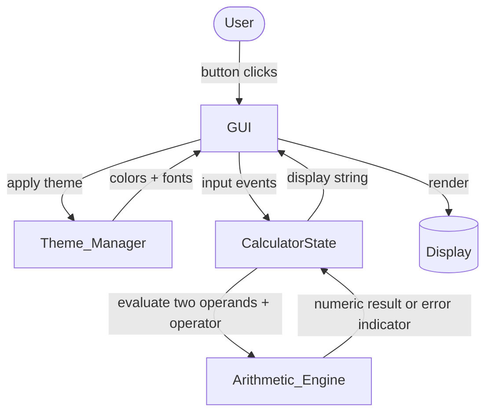

# Design Document

## Overview

The Calculator_App is a Python desktop calculator built with Tkinter, the standard GUI toolkit bundled with the CPython standard library. Choosing Tkinter avoids external GUI dependencies, keeps startup fast (satisfying the 3-second render requirement), and runs cross-platform on the interpreters most users already have installed.

The design separates the application into three cooperating components with a strict dependency direction:

- **Arithmetic_Engine** — a pure, side-effect-free module that evaluates two-operand expressions and reports errors (such as division by zero). It has no knowledge of Tkinter.
- **CalculatorState** — an in-memory model of the current Expression, editing rules, and display formatting. It captures all input/editing behavior (digit entry, decimal handling, clear/delete, post-result transitions) as pure state transitions. It has no knowledge of Tkinter.
- **GUI** — the Tkinter view/controller layer that renders the Display, buttons, and theme selector, translates button clicks into state transitions, and reflects state back onto the Display.
- **Theme_Manager** — applies a named Theme (colors and fonts) to the GUI widgets and tracks the single active Theme.

The key design decision is to push all testable logic (arithmetic and input/editing rules) into pure modules (`Arithmetic_Engine` and `CalculatorState`) that are fully decoupled from Tkinter. This keeps the GUI a thin adapter and makes the bulk of the acceptance criteria verifiable with fast, deterministic property-based tests, without needing to drive a live window.

### Design Goals

- Keep calculation and editing logic independent of the UI framework so it is unit- and property-testable.
- Guarantee that theme changes are purely visual and never mutate the Expression or result (Requirement 6.6).
- Represent errors (division by zero) as explicit values rather than exceptions crossing the UI boundary, so the GUI can render a clear message and recover on the next input (Requirement 3).

## Architecture



### Dependency Direction

Dependencies point inward toward pure logic. The GUI depends on `CalculatorState`, `Theme_Manager`, and the `Arithmetic_Engine`; `CalculatorState` depends on the `Arithmetic_Engine`; neither `CalculatorState` nor the `Arithmetic_Engine` depends on Tkinter. This satisfies the separation-of-concerns intent behind Requirement 5 and makes the logic layers testable in isolation.

### Control Flow (example: pressing "=")

1. The GUI receives the button click and calls `state.press_equals()`.
2. `CalculatorState` validates that the Expression holds exactly two operands and one operator (Requirement 2.8). If not, it returns unchanged.
3. If valid, it invokes `Arithmetic_Engine.evaluate(left, operator, right)`.
4. The engine returns either a numeric `Ok(value)` or `Err(DIVIDE_BY_ZERO)`.
5. `CalculatorState` stores the outcome (result value or error mode) and produces a display string.
6. The GUI reads the display string and writes it to the Display within 200 ms (Requirement 5.3, 2.5).

## Components and Interfaces

### Arithmetic_Engine

A pure module. No I/O, no global state.

```python
from enum import Enum
from dataclasses import dataclass

class Operator(Enum):
    ADD = "+"
    SUBTRACT = "-"
    MULTIPLY = "*"
    DIVIDE = "/"

class EvalError(Enum):
    DIVIDE_BY_ZERO = "divide_by_zero"

@dataclass(frozen=True)
class Ok:
    value: float

@dataclass(frozen=True)
class Err:
    error: EvalError

EvalResult = Ok | Err

def evaluate(left: float, operator: Operator, right: float) -> EvalResult:
    """Apply operator to operands. Returns Err(DIVIDE_BY_ZERO) when dividing by zero,
    otherwise Ok(value)."""
```

Responsibilities:
- Compute addition, subtraction, multiplication, division (Requirement 2.1–2.6).
- Return `Err(DIVIDE_BY_ZERO)` when the operator is division and the divisor is zero (Requirement 3.1).
- Never raise across its boundary for the divide-by-zero case; it is modeled as a return value.

### CalculatorState

Holds the editing model and formatting rules. All methods return a new logical state (or mutate an instance whose fields are then read by the GUI); for testability the transitions are implemented as pure functions over an immutable state value.

```python
from dataclasses import dataclass, field
from enum import Enum

MAX_OPERAND_DIGITS = 15
MAX_SIGNIFICANT_DIGITS = 10

class Mode(Enum):
    EDITING = "editing"       # user is building an expression
    RESULT = "result"         # display shows a completed result, no operator pending
    ERROR = "error"           # division-by-zero message is shown

@dataclass(frozen=True)
class CalculatorState:
    left: str = ""            # first operand as entered (string form)
    operator: Operator | None = None
    right: str = ""           # second operand as entered (string form)
    mode: Mode = Mode.EDITING

    # --- transitions (each returns a new CalculatorState) ---
    def press_digit(self, d: str) -> "CalculatorState": ...
    def press_decimal(self) -> "CalculatorState": ...
    def press_operator(self, op: Operator) -> "CalculatorState": ...
    def press_equals(self) -> "CalculatorState": ...
    def press_clear(self) -> "CalculatorState": ...
    def press_delete(self) -> "CalculatorState": ...

    def display_string(self) -> str:
        """Render the current expression, result, or error message for the Display."""
```

Responsibilities:
- Append digits, enforce the 15-digit operand cap (Requirement 1.1, 1.6).
- Enforce single decimal point per operand and leading-zero rule (Requirement 1.2, 1.3, 1.5).
- Replace display when typing after a bare result (Requirement 1.4).
- Record operators, replacing a pending operator when no second operand exists (Requirement 2.1–2.4, 2.7).
- Guard equals so it only computes with exactly two operands and one operator (Requirement 2.5, 2.8).
- Delegate computation to `Arithmetic_Engine` and format results to 10 significant digits (Requirement 2.6).
- Enter/exit ERROR mode for division by zero (Requirement 3.2–3.5).
- Clear and delete behavior (Requirement 4.1–4.5).

### GUI

Tkinter layer built on a root window with a `Label`/`Entry` acting as the Display and a grid of `Button` widgets. It owns a single `CalculatorState` instance and a `Theme_Manager`.

```python
class CalculatorGUI:
    def __init__(self, root: "tk.Tk"): ...
    def _on_button(self, token: str) -> None:
        """Map a button token to a CalculatorState transition, then refresh the Display."""
    def _refresh_display(self) -> None:
        """Write self.state.display_string() to the Display widget."""
    def _on_theme_selected(self, theme_name: str) -> None:
        """Ask Theme_Manager to apply the selected theme without touching state."""
```

Responsibilities:
- Render Display plus buttons for digits 0–9, decimal, four operators, equals, clear, delete (Requirement 5.1).
- Initialize Display to zero on startup (Requirement 5.2).
- Reflect state changes to the Display within 200 ms (Requirement 5.3–5.5).
- Provide the theme selector and route selection to `Theme_Manager` (Requirement 6.2, 6.3–6.5, 6.8).

### Theme_Manager

```python
@dataclass(frozen=True)
class Theme:
    name: str
    display_bg: str
    display_fg: str
    button_bg: str
    button_fg: str
    accent: str
    font_family: str
    font_size: int

class ThemeManager:
    THEMES: dict[str, Theme]          # "Classic", "Dark", "Fun"
    active: str                        # exactly one active theme name

    def apply(self, theme_name: str, widgets: "WidgetRefs") -> None:
        """Apply theme colors and fonts to Display, all buttons, and the theme selector.
        Sets `active` to theme_name. Does not modify calculator state."""
```

Responsibilities:
- Provide exactly three themes (Requirement 6.2).
- Apply Classic by default at startup (Requirement 6.1).
- Apply the selected theme's colors/fonts to Display, all buttons, and the selector (Requirement 6.3–6.5).
- Keep exactly one active theme and expose it for the selector's active indicator (Requirement 6.7, 6.8).

## Data Models

### Expression Model

An Expression is represented structurally rather than as a raw string, which makes the "exactly two operands and one operator" validation trivial and unambiguous:

| Field | Type | Meaning |
|-------|------|---------|
| `left` | `str` | first operand, as entered (may be empty, may contain one `.`) |
| `operator` | `Operator \| None` | pending operator, or `None` |
| `right` | `str` | second operand, as entered |
| `mode` | `Mode` | EDITING, RESULT, or ERROR |

Operands are stored as strings during entry to faithfully preserve user input (leading zero, trailing decimal point) and are parsed to `float` only at evaluation time.

### Display String Rules

- EDITING with empty state → `"0"` (Requirement 4.1, 5.2).
- EDITING → concatenation of `left`, operator symbol (if any), and `right`.
- RESULT → the formatted numeric result (≤ 10 significant digits, Requirement 2.6).
- ERROR → a fixed message such as `"Cannot divide by zero"` (Requirement 3.2).

### Theme Model

| Theme | Style intent |
|-------|--------------|
| Classic | Light default: light background, dark text (Requirement 6.1) |
| Dark (Kiro) | Dark background, light text |
| Fun | Colorful/playful palette and font |

Each Theme carries background/foreground colors for the Display and buttons, an accent color, and a font family/size, all applied uniformly to Display, buttons, and the theme selector.

### Result Formatting

Results are computed as IEEE-754 `float`. For display, values are formatted to a maximum of 10 significant digits (Requirement 2.6). Integer-valued results render without a trailing `.0`; other values use significant-digit formatting (e.g., Python's `f"{value:.10g}"`), which also collapses floating-point noise within the required 0.0000000001 tolerance.

## Correctness Properties

*A property is a characteristic or behavior that should hold true across all valid executions of a system — essentially, a formal statement about what the system should do. Properties serve as the bridge between human-readable specifications and machine-verifiable correctness guarantees.*

The arithmetic engine and calculator state transitions are pure functions with a large input space, making them well suited to property-based testing. The properties below are derived from the prework analysis, with redundant criteria consolidated. UI rendering, theme styling application, and timing bounds are covered by the Testing Strategy section using smoke, integration, and example tests rather than properties.

### Property 1: Digit append respects the 15-digit cap

*For any* calculator state and *any* digit 0–9, pressing that digit either appends it to the current operand (when the operand has fewer than 15 digits) leaving all other operands and the operator unchanged, or leaves the state unchanged (when the current operand already has 15 digits). The current operand's digit count never exceeds 15.

**Validates: Requirements 1.1, 1.6**

### Property 2: Decimal point handling

*For any* calculator state, pressing the decimal point button results in the current operand containing exactly one decimal point: if the operand had none it gains one (starting with a leading zero when the operand was empty), and if it already had one the state is left unchanged.

**Validates: Requirements 1.2, 1.3, 1.5**

### Property 3: Digit from a terminal display starts a fresh expression

*For any* calculator state in RESULT mode (a bare previous result, no pending operator) or ERROR mode, pressing a digit produces a new EDITING expression whose entire content is exactly that single digit, with no error message and no residual result.

**Validates: Requirements 1.4, 3.5**

### Property 4: Operator recording

*For any* calculator state that contains at least one operand and no pending operator, pressing any of the four operators (add, subtract, multiply, divide) records exactly that operator in the expression and leaves the entered operands unchanged.

**Validates: Requirements 2.1, 2.2, 2.3, 2.4**

### Property 5: Operator replacement when no second operand exists

*For any* calculator state that has an operator recorded and an empty second operand, pressing any operator replaces the recorded operator with the newly selected one and leaves both operands unchanged.

**Validates: Requirements 2.7**

### Property 6: Evaluation matches the reference operation

*For any* two operands and *any* operator that is not division-by-zero, the Arithmetic_Engine result equals the mathematical application of that operator to the two operands, accurate to within 0.0000000001, and is displayed to at most 10 significant digits.

**Validates: Requirements 2.5, 2.6, 5.5**

### Property 7: Equals is a no-op on incomplete expressions

*For any* calculator state that does not contain exactly two operands and one operator, pressing equals does not produce a result and leaves the state and display unchanged.

**Validates: Requirements 2.8**

### Property 8: Division by zero yields an error, never a numeric result

*For any* left operand, evaluating division with a divisor of zero returns the division-by-zero error indicator and no numeric value; when this occurs on equals, the resulting state is in ERROR mode showing the divide-by-zero message, suppressing any numeric result, and retaining that error state until a clear or delete action.

**Validates: Requirements 3.1, 3.2, 3.3**

### Property 9: Clear resets to a single zero from any state

*For any* calculator state (including RESULT and ERROR states), pressing clear yields an empty expression whose display shows a single zero.

**Validates: Requirements 4.1, 3.4**

### Property 10: Delete removes the last character with a floor at zero

*For any* calculator state in EDITING mode, pressing delete removes exactly the most recently entered character; when the expression had more than one character the display equals the previous display without its last character, and when it had one character or was empty the display shows a single zero.

**Validates: Requirements 4.2, 4.3, 4.4**

### Property 11: Delete does not alter a displayed result

*For any* calculator state in RESULT mode (showing only a previous result), pressing delete leaves the state and displayed result unchanged.

**Validates: Requirements 4.5**

### Property 12: Display rendering is total

*For any* reachable calculator state produced by any sequence of button transitions, `display_string()` returns a valid non-empty string without raising, and that string is exactly what the GUI renders on the Display.

**Validates: Requirements 5.4**

### Property 13: Applying a theme preserves calculator state

*For any* calculator state and *any* of the three theme names, applying that theme leaves the calculator state and its display string unchanged.

**Validates: Requirements 6.6**

### Property 14: Exactly one theme is active

*For any* sequence of theme applications, after the sequence completes exactly one theme is active and it equals the most recently applied theme.

**Validates: Requirements 6.7**

## Error Handling

### Division by Zero

Modeled as an explicit return value (`Err(EvalError.DIVIDE_BY_ZERO)`) rather than a raised exception, so the error never propagates uncontrolled into the GUI. When `CalculatorState.press_equals()` receives an `Err`, it transitions to `Mode.ERROR` and `display_string()` returns the fixed message `"Cannot divide by zero"` (Requirement 3.2). The entered expression is retained internally and the state remains in ERROR until the user presses clear (resets to zero, Requirement 3.4) or a digit (starts a fresh expression, Requirement 3.5).

### Invalid / Incomplete Expressions

Pressing equals on an expression that is not exactly two operands and one operator is treated as a no-op — `press_equals()` returns the same state unchanged (Requirement 2.8). No exception is raised.

### Input Boundary Enforcement

- Digit entry beyond 15 digits per operand is silently ignored (Requirement 1.6).
- A second decimal point in an operand is silently ignored (Requirement 1.3).
- Delete on an empty or single-character expression floors the display at `"0"` (Requirement 4.3, 4.4).

These are not error conditions but guarded transitions that leave the state well-formed.

### Numeric Overflow / Special Values

Very large multiplications may produce `float('inf')`. Formatting to 10 significant digits handles this by rendering the platform float representation; the design treats non-divide-by-zero arithmetic as always returning `Ok`. Guarding against overflow display is left to the formatter, which renders `inf`/`-inf` as-is rather than crashing.

### GUI Layer

Because pure logic never raises for expected conditions, the GUI's button handlers do not need broad exception handling around state transitions. Any unexpected exception is allowed to surface during development rather than being silently swallowed.

## Testing Strategy

### Approach

The test suite combines property-based tests (for the pure arithmetic and state logic) with example, edge-case, integration, and smoke tests (for UI, theming, and timing concerns that are not input-varying).

### Property-Based Testing

- **Library**: [Hypothesis](https://hypothesis.readthedocs.io/) — the standard property-based testing library for Python. The team MUST NOT implement property-based testing from scratch.
- **Iterations**: Each property test MUST run a minimum of 100 iterations (Hypothesis `max_examples=100` or higher).
- **Generators**: A `CalculatorState` strategy generates reachable states across all modes (EDITING, RESULT, ERROR), including boundary operands (empty, one digit, exactly 15 digits, containing a decimal point). An operand strategy covers negatives, zero, decimals, and large magnitudes.
- **Traceability**: Each property test MUST be tagged with a comment referencing its design property, in the format:
  `# Feature: calculator-app, Property {number}: {property_text}`
- Properties 1–14 above each map to a SINGLE property-based test.

### Unit / Example Tests

Focused example tests cover specific behaviors and initial conditions that are not universally quantified:
- Fresh `CalculatorState.display_string()` returns `"0"` (Requirement 5.2).
- `ThemeManager` initializes with `active == "Classic"` (Requirement 6.1).
- `ThemeManager.THEMES` keys are exactly `{"Classic", "Dark", "Fun"}` (Requirement 6.2).
- The theme selector's active indicator matches `ThemeManager.active` after selection (Requirement 6.8).

### Edge-Case Tests

Boundary conditions are primarily exercised through property generators (15-digit cap, single/empty delete). Targeted example tests pin the exact boundary transitions for regression safety.

### Integration Tests

Theme application to Tkinter widgets is verified by applying each theme (Classic, Dark, Fun) and asserting representative widget option values (background, foreground, font) match the theme definition for the Display, buttons, and selector (Requirements 6.3, 6.4, 6.5). 1–3 representative examples per theme.

### Smoke Tests

- Construct the GUI and assert the Display exists and a button exists for each token: digits 0–9, decimal, the four operators, equals, clear, delete (Requirement 5.1).

### Timing / Performance Checks

Timing bounds (equals within 200 ms, button-to-display within 200 ms, theme apply within 1 s, startup within 3 s) are validated with single timed example tests that measure the relevant operation and assert it completes within the bound (Requirements 2.5, 5.1, 5.3, 6.3–6.5). These are not property tests, since the behavior does not vary meaningfully with input.

### Test Environment Note

Tkinter tests require a display server. In headless CI environments, use a virtual framebuffer (e.g., `xvfb`) or skip GUI-construction tests while still running the pure-logic property tests, which have no display dependency.
